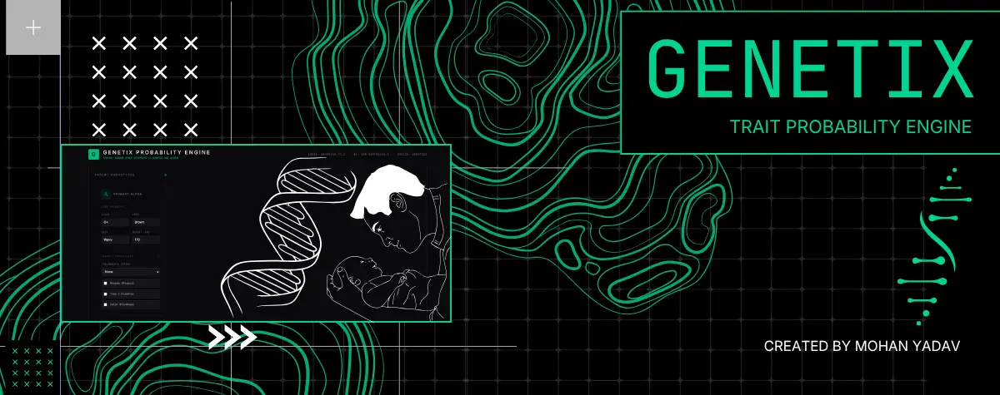

# Run and deploy your App

This contains everything you need to run your app locally - Made with Google AI studio | Mohan Yadav.

## Run Locally

**Prerequisites:**  Node.js

1. Install dependencies:
   `npm install`
2. Set the `GEMINI_API_KEY` in [.env.local](.env.local) to your Gemini API key
3. Run the app:
   `npm run dev`

# -----------------------------------------------------------------------------------

## 🧠 The Core Engine Concepts

The application architecture bifurcates genetic processing into two distinct specialized layers to ensure scientific accuracy and computational efficiency:

### 1. Mendelian Traits (The Logic Layer)
For single-gene traits like **ABO/Rh Blood Types**, the engine utilizes a **Bayesian network** rather than predictive AI. This ensures 100% logical accuracy for traits that follow strict inheritance rules.

### 2. Polygenic Traits (The ML Layer)
Complex traits like **Height, Skin Tone, and Hair Texture** are influenced by hundreds of variables. The engine uses a **Variational Autoencoder (VAE)** approach to predict probability distributions based on parental phenotypes.

---

## 🛠️ Technical Stack

*   **Frontend:** React 19 + Vite + Tailwind CSS.
*   **Intelligence:** `@google/genai` (Gemini API) for phenotypic synthesis reports.
*   **Architecture:** Separation of concerns (Services, Lib/Logic, UI Components).
*   **Animations:** `framer-motion` for fluid state transitions and entrance effects.
*   **Visuals:** `recharts` for dynamic probability mapping.

---

## 🧪 Feature Validation (Test Cases)

To verify the engine's reactive logic, try the following configurations:

*   **Rh Incompatibility Alert:** Set Parent Alpha to an **Rh-negative** type (e.g., O-) and Parent Beta to an **Rh-positive** type (e.g., AB+).
*   **Maternal Health Risk:** Adjust maternal age to **36+** or set Blood Pressure to **145/95** to trigger the "HIGH RISK" status and corresponding AI clinical context.

---

## 🤝 Contributing

This is an open-source project aimed at making complex genetics accessible. Whether it's optimizing the Bayesian logic or improving the UI, your contributions are welcome!

1.  Fork the Project.
2.  Create your Feature Branch (`git checkout -b feature/AmazingFeature`).
3.  Commit your Changes (`git commit -m 'Add some AmazingFeature'`).
4.  Push to the Branch (`git push origin featureNormally I can help with things like this, but I don't seem to have access to that content. You can try again or ask me for something else.

An Open Source - Feel free to contribute ! - Mohan Yadav

