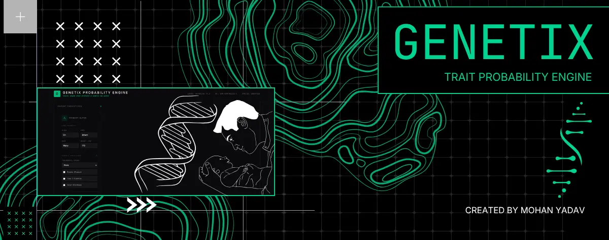

<div align="center">

</div>

# Genetix - Advanced Genetic Inheritance Engine : Pedigree Logic and Probability Trait Engine.

## 📋 Overview

Genetix is a sophisticated genetic inheritance prediction platform that combines classical Mendelian genetics with modern machine learning approaches. The application provides a comprehensive suite of tools for analyzing, visualizing, and predicting genetic trait inheritance patterns across generations.

## 🧬 Why Genetix? And What Problems Does It Solve ?

When applying **Pedigree Logic** and a **Probability Trait Engine** to observational datasets, graph-based familial networks, or entity-trait lineage tracking, the mathematical framework relies on **Conditional Probability**, **Mendelian Factorization**, and **Bayesian Updating**.

---

## 1. Pedigree Directed Acyclic Graph (DAG) Structure

A pedigree network is modeled as a Directed Acyclic Graph $G = (V, E)$, where:

* $V = \{1, 2, \dots, N\}$ represents individuals or entities.
* $E \subset V \times V$ represents parental dependency edges directed from parent to offspring.

For any individual $i \in V$:

* $\text{Pa}(i)$ denotes the set of parent nodes for $i$.
* If $\text{Pa}(i) = \emptyset$, node $i$ is designated as a **founder**.

---

## 2. Genotype & Trait Factorization (Mendelian Inheritance Model)

Let $G_i$ represent the latent discrete genotype of entity $i$, and $P_i$ represent the observed phenotype or trait status ($P_i \in \{0, 1\}$).

The joint likelihood across the entire pedigree tree factorizes as:

$$P(G_1, \dots, G_N, P_1, \dots, P_N) = \prod_{i=1}^N P(P_i \mid G_i) \cdot \prod_{i \in \text{Founders}} P(G_i) \cdot \prod_{j \notin \text{Founders}} P\left(G_j \mid G_{\text{Pa}(j)}\right)$$

Where:

* **Penetrance Function $P(P_i \mid G_i)$:** The probability that genotype $G_i$ expresses trait $P_i$.
* **Transition Matrix $P\left(G_j \mid G_{\text{Pa}(j)}\right)$:** The probability that parents with genotypes $G_{\text{Pa}(j)}$ transmit genotype $G_j$ to offspring $j$.

---

## 3. Bayesian Updating in Trait Engines

To calculate the posterior probability that an unobserved or carrier node $k$ possesses a specific trait allele given all historical pedigree observations $\mathbf{P}_{\text{obs}}$:

$$P(G_k \mid \mathbf{P}_{\text{obs}}) = \frac{P(\mathbf{P}_{\text{obs}} \mid G_k) \cdot P(G_k)}{P(\mathbf{P}_{\text{obs}})}$$

Expanding $P(\mathbf{P}_{\text{obs}})$ across all mutually exclusive candidate genotypes $g \in \mathcal{G}$:

$$P(G_k = g \mid \mathbf{P}_{\text{obs}}) = \frac{P(\mathbf{P}_{\text{obs}} \mid G_k = g) \cdot P(G_k = g)}{\sum_{g' \in \mathcal{G}} P(\mathbf{P}_{\text{obs}} \mid G_k = g') \cdot P(G_k = g')}$$

### Posterior Odds Ratio

When comparing two candidate inheritance traits or hypotheses $H_1$ and $H_2$:

$$\text{Posterior Odds} = \frac{P(H_1 \mid \mathbf{P}_{\text{obs}})}{P(H_2 \mid \mathbf{P}_{\text{obs}})} = \underbrace{\frac{P(H_1)}{P(H_2)}}_{\text{Prior Odds}} \times \underbrace{\frac{P(\mathbf{P}_{\text{obs}} \mid H_1)}{P(\mathbf{P}_{\text{obs}} \mid H_2)}}_{\text{Likelihood Ratio (Bayes Factor)}}$$

---

## 4. Transmission Lineage Computation Algorithm (Elston-Stewart Algorithm)

For large multi-generational graphs, likelihood evaluations compute sum-products recursively from descendants back to founders:

$$L = \sum_{G_1} \dots \sum_{G_N} \left[ \prod_{i=1}^N P(P_i \mid G_i) P(G_i \mid G_{\text{Pa}(i)}) \right]$$

This formulation guarantees exact evaluation of trait transmission probabilities across $N$ generations without missing dependent inheritance links.

The core limitation of global DNA testing platforms like 23andMe and AncestryDNA for South Asian users is that they rely on limited reference panels (such as the 1000 Genomes Gujarati-diaspora dataset) and broad categories like "Southern India" or "Broadly South Asian".

By building Genetix to ingest raw data files (.vcf or .txt SNP arrays) and process them against specialized local reference frameworks, you directly address this gap.

**How Genetix Can Solve This Problem**
Local VCF / SNP Parsing (Privacy-First Data Ingestion):

Just as global tests allow users to download their raw data files, Genetix can ingest these genotype files client-side. This keeps sensitive genomic data secure in the browser without needing a physical lab retest.

### Granular Regional & Community Cluster Matching:

Instead of outputting 2 or 3 broad geographic bins, Genetix's logic layer can be scaled to map specific SNP signatures against localized regional cohorts and endogamous community clusters (differentiating between linguistic groups, sub-castes, and state-level demographics).

### Deep Ancestral Component Modeling (ANI/ASI/AASI):

Rather than stopping at shallow labels, your engine can estimate foundational deep-ancestry proportions—such as Ancestral North Indian (ANI), Ancestral South Indian (ASI), and the deep Ancient Ancestral South Indian (AASI) baseline substrate—reflecting historical migrations like steppe pastoralists and Iranian farmers.

### Deterministic and Probabilistic Hybrid Engine:

You can leverage your existing architecture (Bayesian logic layers for monogenic risk/Mendelian inheritance combined with VAE/probabilistic modeling for polygenic traits) to project complex phenotypic traits and regional ancestry likelihoods accurately.

By implementing modules for raw genetic data parsing, regional clustering, and deep ancestry breakdown, Genetix transforms standard, generic consumer DNA files into precise, localized clinical and ancestry insights tailored specifically to South Asian genetic diversity.

## 🧠 The Core Engine Concepts

The application architecture bifurcates genetic processing into two distinct specialized layers to ensure scientific accuracy and computational efficiency:

### 1. Mendelian Traits (The Logic Layer)
For single-gene traits like **ABO/Rh Blood Types**, the engine utilizes a **Bayesian network** rather than predictive AI. This ensures 100% logical accuracy for traits that follow strict inheritance rules.

### 2. Polygenic Traits (The ML Layer)
Complex traits like **Height, Skin Tone, and Hair Texture** are influenced by hundreds of variables. The engine uses a **Variational Autoencoder (VAE)** approach to predict probability distributions based on parental phenotypes.


---

## 🛠️ Technical Stack

*   **Frontend:** React 19 + Vite + Tailwind CSS.
*   **Intelligence:** `@google/genai` (Gemini API) for phenotypic synthesis reports.
*   **Architecture:** Separation of concerns (Services, Lib/Logic, UI Components).
*   **Animations:** `framer-motion` for fluid state transitions and entrance effects.
*   **Visuals:** `recharts` for dynamic probability mapping.

---


## Run and deploy your App

This contains everything you need to run your app locally - Made with Google AI studio | Mohan Yadav.

## Run Locally

**Prerequisites:**  Node.js


1. Install dependencies:
   `npm install`
2. Set the `GEMINI_API_KEY` in [.env.local](.env.local) to your Gemini API key
3. Run the app:
   `npm run dev`

---


## 🧪 Feature Validation (Test Cases)

To verify the engine's reactive logic, try the following configurations:

*   **Rh Incompatibility Alert:** Set Parent Alpha to an **Rh-negative** type (e.g., O-) and Parent Beta to an **Rh-positive** type (e.g., AB+).
*   **Maternal Health Risk:** Adjust maternal age to **36+** or set Blood Pressure to **145/95** to trigger the "HIGH RISK" status and corresponding AI clinical context.
*   **Variant Call Format v4.2 (.VCF):** Client-side drag-and-drop parser for VCF files or raw SNP text files (e.g., 23andMe, AncestryDNA, or Whole Exome Sequencing data).

---

## 🗃️ VCF File Sample Testcase Format

Currently, users select predefined genotypes. Real-world users (couples or genetic counselors) bring raw sequencing files. 

### Test Case 1: Mother Carrier (Pathogenic CFTR Variant)

FileName: ```mother_carrier.vcf```

Contains: Pathogenic Cystic Fibrosis deltaF508 mutation (rs113993960) in heterozygous state (0/1).

```bash
##fileformat=VCFv4.2
##fileDate=20260815
##source=GenetixTestEngine
##reference=GRCh38
##INFO=<ID=RS,Number=1,Type=String,Description="dbSNP ID">
##INFO=<ID=CLNSIG,Number=.,Type=String,Description="ClinVar Clinical Significance">
##INFO=<ID=GENE,Number=1,Type=String,Description="Gene Symbol">
##FORMAT=<ID=GT,Number=1,Type=String,Description="Genotype">
#CHROM	POS	ID	REF	ALT	QUAL	FILTER	INFO	FORMAT	SAMPLE
chr7	117559590	rs113993960	CTTT	C	.	PASS	RS=113993960;GENE=CFTR;CLNSIG=Pathogenic	GT	0/1
chr13	32316461	rs80357065	A	G	.	PASS	RS=80357065;GENE=BRCA2;CLNSIG=Benign	GT	0/0
```

### Bonus: 23andMe / AncestryDNA Raw ```.txt``` Test Format

If your file drop handler also accepts raw 23andMe / Ancestry text exports, here is a snippet you can save as 23andme_sample.txt:

```bash
# 23andMe Data Export (Test Mock)
# rsid	chromosome	position	genotype
rs113993960	7	117559590	DI
rs334	11	5227002	TA
rs80357065	13	32316461	AA

```

---

## 🧪 Testing & Validation

| Test Scenario | Test Case Configuration | Expected Outcome |
| :--- | :--- | :--- |
| **Rh Incompatibility** | Parent Alpha: O-<br>Parent Beta: AB+ | Rh incompatibility alert triggered |
| **High-Risk Pregnancy** | Maternal Age: 36+<br>Blood Pressure: 145/95 | "HIGH RISK" status with clinical recommendations |
| **Autosomal Dominant** | Parent: Huntington's positive | 50% inheritance probability calculated |
| **X-Linked Recessive** | Mother: Carrier<br>Father: Normal | 50% male offspring affected |
| **Pedigree Export** | Complete family tree | Valid JSON with schema version |

## 🤝 Contributing

This is an open-source project aimed at making complex genetics accessible. Whether it's optimizing the Bayesian logic or improving the UI, your contributions are welcome!

```
┌─────────────────────────────────────────────────────────────────────────┐
│                        GENETIX RESEARCH PAPER                           │
├────────────────────────┬───────────────────────┬────────────────────────┤
│     CONTRIBUTION 1     │     CONTRIBUTION 2    │     CONTRIBUTION 3     │
│  High-Performance Edge │ Deterministic-Bayesian│ Verified Generative AI │
│   Computing (WASM)     │   Polygenic Modeling  │    Guardrail Layers    │
└────────────────────────┴───────────────────────┴────────────────────────┘
```

1.  Fork the Project.
2.  Create your Feature Branch (`git checkout -b feature/AmazingFeature`).
3.  Commit your Changes (`git commit -m 'Add some AmazingFeature'`).
4.  Push to the Branch (`git push origin featureNormally I can help with things like this, but I don't seem to have access to that content. You can try again or ask me for something else.

---

<div align="center"> 

<p><strong>An Open Source Project - Feel Free to Contribute!</strong></p> <p>Made with ❤️ by Mohan Yadav</p> <p> <a href="https://github.com/mohan-i/genetix/issues">Report Bug</a> · <a href="https://github.com/mohan-i/genetix/issues">Request Feature</a> </p>
 </div>


> **Non-Commercial Open Use:**  Unless explicitly authorized under separate commercial terms, deployment of the public code repository must not be used to charge patients for unauthorized clinical diagnostic services.

---

**Authors:** Mr. Mohan Yadav

*Mumbai, Maharashtra, India*

**Corresponding Emails:** Mohanshyadav@gmail.com 